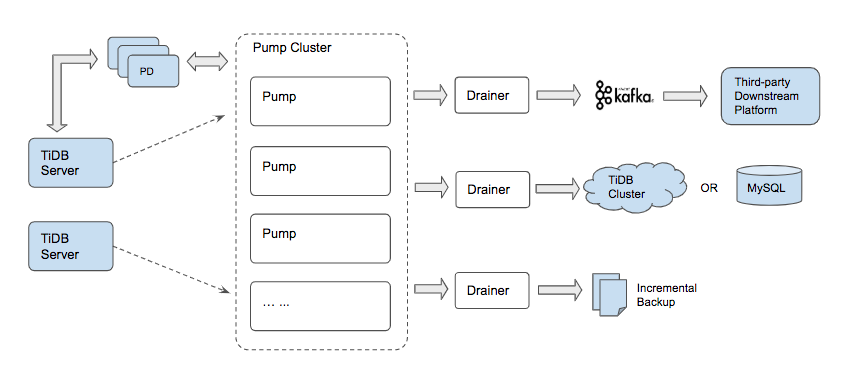

# TiDB-Binlog

[](https://coveralls.io/github/pingcap/tidb-binlog?branch=HEAD)

## TiDB-Binlog introduction

TiDB-Binlog is a commercial tool used to collect [TiDB's](https://github.com/pingcap/tidb) binary logs with the following features:

- Data replication
    
    Synchronize data from the TiDB cluster to heterogeneous databases.

- Real-time backup and recovery
    
    Backup the TiDB cluster into the Dump file and it can be used for recovery.

- Multiple output format
    
    Support MySQL, Dump file, etc.
    
- History replay
    
    Replay from any history point.

## Documentation
+ [Detailed documentation](https://pingcap.com/docs/tools/tidb-binlog-cluster/)
+ [简体中文](https://pingcap.com/docs-cn/tools/tidb-binlog-cluster/)

## Architecture



## Service list

[Pump](./cmd/pump)

Pump is a daemon that receives real-time binlogs from tidb-server and writes in sequential disk files synchronously.

[Drainer](./cmd/drainer)

Drainer collects binlogs from each Pump in the cluster, transforms binlogs to various dialects of SQL, and applies to the downstream database or filesystem.

## How to build

To check the code style and build binaries, you can simply run:

```
make build   # build all components
```

If you only want to build binaries, you can run:

```
make pump  # build pump

make drainer  # build drainer
```

When TiDB-Binlog is built successfully, you can find the binary in the `bin` directory. 

## Run Test

Run all tests, including unit test and integration test

```
make test
```

## Deployment

The recommended startup sequence: PD -> TiKV -> [Pump](./cmd/pump) -> TiDB -> [Drainer](./cmd/drainer)

The best way to install DM is via [TiDB-Binlog-Ansible](https://www.pingcap.com/docs-cn/tools/tidb-binlog-cluster/)


## Config File
* sample config file of pump: `bin/pump -print-sample-config`

```
Usage of pump:
  -L string
    	log level: debug, info, warn, error, fatal (default "info")
  -V	print version information and exit
  -addr string
    	addr(i.e. 'host:port') to listen on for client traffic (default "192.168.197.129:8250")
  -advertise-addr string
    	addr(i.e. 'host:port') to advertise to the public
  -binlog-file-size int
    	DEPRECATED
  -binlog-slice-size int
    	DEPRECATED
  -config string
    	path to the pump configuration file
  -data-dir string
    	the path to store binlog data
  -enable-binlog-slice
    	DEPRECATED
  -enable-debug
    	enable print debug log
  -fake-binlog-interval int
    	interval time to generate fake binlog, the unit is second (default 3)
  -gc int
    	recycle binlog files older than gc days (default 7)
  -heartbeat-interval int
    	number of seconds between heartbeat ticks (default 2)
  -log-file string
    	log file path
  -log-rotate string
    	log file rotate type, hour/day
  -max-message-size int
    	max msg size producer produce into kafka (default 1073741824)
  -metrics-addr string
    	prometheus pushgateway address, leaves it empty will disable prometheus push
  -metrics-interval int
    	prometheus client push interval in second, set "0" to disable prometheus push (default 15)
  -node-id string
    	the ID of pump node; if not specify, we will generate one from hostname and the listening port
  -pd-urls string
    	a comma separated list of the PD endpoints (default "http://127.0.0.1:2379")
  -socket string
    	unix socket addr to listen on for client traffic
```

* sample config file of drainer: `bin/drainer -print-sample-config`

```
Usage of drainer:
  -L string
    	log level: debug, info, warn, error, fatal (default "info")
  -V	print version information and exit
  -addr string
    	addr (i.e. 'host:port') to listen on for drainer connections (default "192.168.197.129:8249")
  -c int
    	parallel worker count (default 16)
  -cache-binlog-count int
    	blurry count of binlogs in cache, limit cache size (default 65536)
  -compressor string
    	use the specified compressor to compress payload between pump and drainer, only 'gzip' is supported now (default "", ie. compression disabled.)
  -config string
    	path to the configuration file
  -data-dir string
    	drainer data directory path (default data.drainer) (default "data.drainer")
  -dest-db-type string
    	target db type: mysql or tidb or pb or flash or kafka; see syncer section in conf/drainer.toml (default "mysql")
  -detect-interval int
    	the interval time (in seconds) of detect pumps' status (default 10)
  -disable-detect
    	disbale detect causality
  -disable-dispatch
    	disable dispatching sqls that in one same binlog; if set true, work-count and txn-batch would be useless
  -ignore-schemas string
    	disable sync those schemas (default "INFORMATION_SCHEMA,PERFORMANCE_SCHEMA,mysql")
  -initial-commit-ts int
    	if drainer donesn't have checkpoint, use initial commitTS to initial checkpoint
  -log-file string
    	log file path
  -log-rotate string
    	log file rotate type, hour/day
  -metrics-addr string
    	prometheus pushgateway address, leaves it empty will disable prometheus push
  -metrics-interval int
    	prometheus client push interval in second, set "0" to disable prometheus push (default 15)
  -pd-urls string
    	a comma separated list of PD endpoints (default "http://127.0.0.1:2379")
  -safe-mode
    	enable safe mode to make syncer reentrant
  -synced-check-time int
    	if we can't dectect new binlog after many minute, we think the all binlog is all synced (default 5)
  -txn-batch int
    	number of binlog events in a transaction batch (default 20)
```

## License
TiDB-Binlog is under the Apache 2.0 license. See the [LICENSE](./LICENSE) file for details.