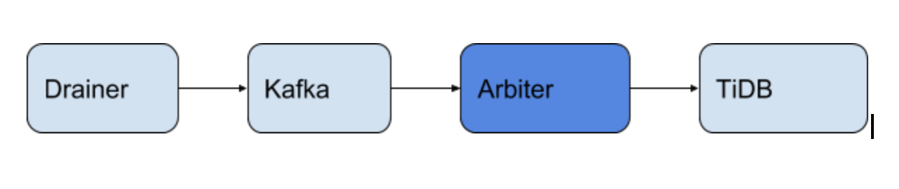

Arbiter
==========

**Arbiter** 是一个从 Kafka 获取 Binlog 增量同步数据到 TiDB 的工具.



整体工作原理如下：

1. 读取 Kafka 的 [Protobuf](https://github.com/pingcap/tidb-tools/blob/master/tidb-binlog/slave_binlog_proto/proto/binlog.proto) 格式 Binlog 。
2. 达到一定数据量后 根据 Binlog 构造对应 SQL 并发写入下游（注意 Arbiter 会拆分上游事务)。
3. 保存 checkpoint 。


## Checkpoint
`arbiter` 会在下游 TiDB `tidb_binlog.arbiter_checkpoint` 表里保存一条 checkpoint 记录。
```
mysql> select * from tidb_binlog.arbiter_checkpoint;
+-------------+--------------------+--------+
| topic_name  | ts                 | status |
+-------------+--------------------+--------+
| test_kafka4 | 405809779094585347 |      1 |
+-------------+--------------------+--------+
```
- topic_name: 消费的 Kafka 主题名。
- ts: 当前同步到了哪个 ts
- status:
	* 0
	表示 <= ts 的数据都同步到下游了。
	* 1
	运行中或者异常退出，> ts 后的部分 Binlog 可能同步到下游。


## 监控告警

Arbiter 支持给 [Prometheus](https://prometheus.io/) 采集度量 (metrics)。本节不要介绍 Arbiter 的监控配置与监控指标。

### 监控配置

只要 Prometheus 能发现 **Arbiter** 的监控地址，就能收集监控指标。

监控的端口可在 arbiter.toml 中配置：

```toml
# addr (i.e. 'host:port') to listen on for Arbiter connections
addr = "0.0.0.0:8251"
```

要让 Prometheus 发现 Arbiter，可以将地址直接写入其配置文件，例如：
```yml
scrape_configs:
  - job_name: 'arbiter'
    honor_labels: true # don't overwrite job & instance labels
    static_configs:
      - targets: ['192.168.20.10:8251']
```

#### 导入 Grafana 面板

执行以下步骤，为 Arbiter 导入 Grafana 面板：

1. 点击侧边栏的 Grafana 图标。

2. 在侧边栏菜单中，依次点击 **Dashboards** > **Import** 打开 **Import Dashboard** 窗口。

3. 点击 **Upload .json File** 上传对应的 JSON 文件（下载 [Arbiter 配置文件](./arbiter.json))。

4. 点击 **Load**。

5. 选择一个 Prometheus 数据源。

6. 点击 **Import**，Prometheus 面板即导入成功。

### 监控指标

本节将详细介绍 **arbiter** 的监控指标.

* **`binlog_arbiter_checkpoint_tso`** (测量仪)

	对应 `tidb_binlog.arbiter_checkpoint` 表里的 ts

* **`binlog_arbiter_query_duration_time`** (直方图)

	写下游需时的直方图。标签:

	* **type**: `exec` `commit` 执行 SQL 跟提交时的耗时。

* **`binlog_arbiter_event`** (计数器)

	计算事件次数

	* **type**: `DDL` `Insert` `Update` `Delete` `Txn`

* **`binlog_arbiter_queue_size`** (测量仪)

	内部队列数据囤积大小。标签：
	
	* **name**: `kafka_reader` `loader_input`

* **`binlog_arbiter_txn_latency_seconds`** (直方图)

	上游事务提交(commitTS物理时间) 到对应事务写入下游的花时。

### 报警配置

执行以下步骤，为 Arbiter 导入 Prometheus 告警规则：

1. 下载 Arbiter 报警规则文件 [Arbiter 配置文件](./arbiter.rules.yml) 放到 Prometheus 的配置文件目录下。

2. Prometheus 配置文件 `prometheus.yml` 在 rule_files 添加对应文件:

```
# Load and evaluate rules in this file every 'evaluation_interval' seconds.
rule_files:
  - 'arbiter.rules.yml'
```

### 报警规则

本节介绍 Arbiter 的告警规则。

#### `binlog_arbiter_checkpoint_high_delay`

* 报警规则:

    `(time() - binlog_arbiter_checkpoint_tso / 1000) > 3600`

* 规则描述:

    Arbiter 同步落后超过一个小时则报警。

* 处理方法:

    同步慢或者同步历史数据造成的，需要查看监控定位问题。

#### `binlog_arbiter_checkpoint_tso_no_change_for_1m`

* 报警规则:

    `changes(binlog_arbiter_checkpoint_tso[1m]) < 1`

* 规则描述:

    Arbiter checkpoint 一分钟没更新则报警。

* 处理方法:

    没有数据源或者同步异常阻塞造成的, 需要查看监控定位问题。

